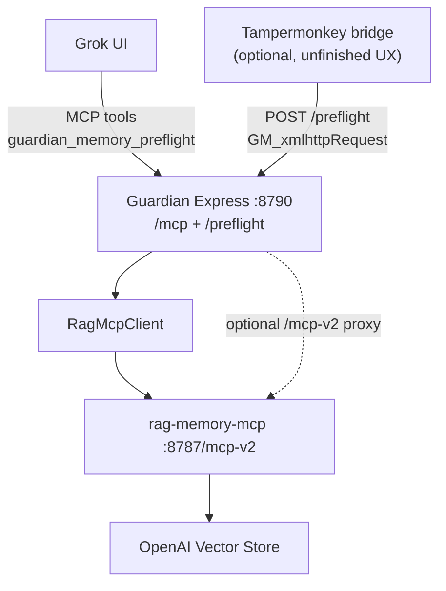

# Scarlett Guardian MCP — Architecture Deep Dive

**Date:** 2026-07-14 (amended same day)  
**Scope:** `/home/maz3ppa/projects/AMG_GT_Black_Prototype/scarlett-guardian-mcp`  
**Audience:** operators and implementers who need to understand why Guardian exists, how it wraps `rag-memory-mcp`, and what to improve next for daily Grok RP.

This is a new analysis document. It does not replace older docs; it consolidates the current live architecture as of mid-July 2026.

**Amendment note:** Operator clarified that Grok 4.3 now calls Guardian tools consistently; timeout bugs were fixed via background reindex on RAG. Forward priority is **maximum report quality** (deeper corpus use + LLM weaving + full-duplex dialogue audit), not cost-minimizing simplification. See `docs/guardian-report-quality-critique-2026-07.md`.

---

## 1. Why this exists

Grok is excellent at immersive Scarlett voice, but unreliable at **mechanical memory discipline**. When scenes feel continuous, Grok often skips retrieval and invents continuity. Native multi-agent / “team” workflows that once enforced librarian behavior were removed from the platform.

`scarlett-guardian-mcp` restores that discipline as middleware:

```text
Grok = novelist
Guardian = continuity agent (librarian + auditor + write-back staging) replacing the lost Grok “agent team” slack
RAG Memory MCP = searchable canon / state / archive
```

Guardian does **not** replace Scarlett’s prose. It retrieves, synthesizes, and returns a novelist-facing brief so Grok confronts retrieved truth before writing.

### Non-negotiable contract

1. Preflight before in-character RP.
2. Prefer retrieved memory over model invention.
3. Stage material continuity changes; do not silently rewrite canon.
4. Keep public exposure on Guardian, keep RAG private behind it.

---

## 2. High-level architecture



### Division of labor with RAG

| Concern | Owner |
|---------|-------|
| Index Markdown, ranking, vector search, stage/approve write files | `rag-memory-mcp` |
| Trigger policy, query fan-out, confidence reports, serendipity, write mode | `scarlett-guardian-mcp` |
| Narrative voice | Grok |
| Force preflight when Grok skips tools | Browser bridge (optional insurance; MCP path currently working well on Grok 4.3) |

---

## 3. Runtime surface

### Endpoints

| Endpoint | Purpose |
|----------|---------|
| `GET /health` | Shallow health; does not deep-call RAG by default |
| `POST /mcp` | MCP tools for Grok connector |
| `POST /preflight` | JSON API for browser bridge / scripts |
| `POST /mcp-v2` | Optional transparent proxy to RAG (when enabled) |

Default port: **8790**. Optional bearer auth (`MCP_BEARER_TOKEN`). CORS enabled for browser bridge callers.

### Tools exposed to Grok

| Tool | Role |
|------|------|
| `guardian_memory_preflight` | Primary gate. Returns a compact Grok brief (MCP) or full JSON report (`/preflight`). |
| `guardian_ooc_consult` | Optional OOC consult path when enabled. |

Daily RP should treat Guardian as **1–2 tools**, not a full RAG catalog. Grok should not need ten memory tools in the connector UI.

---

## 4. Preflight pipeline (current code reality)

Conceptual flow in `runGuardianPreflight`:

1. **Classify** the user turn (in-character vs OOC, memory triggers, emotional tags).
2. **Index status** via RAG `index_status`.
3. **Retrieve live scene** via `retrieve_story_context`.
4. **Targeted corpus searches** via `search_story_memory` when triggers fire (or force-full mode). Query count is still conservative in code (often 1, max 2 under force-full) — a temporary timeout-era limit, not the quality end-state.
5. **Expand / verify** helpers exist in code but are **hard-disabled** in preflight (`DISABLED TO FIX TIMEOUTS`). Safe to re-enable under explicit time budgets now that write reindex is backgrounded.
6. **LLM assessment** (`GUARDIAN_LLM_ENABLED`) — continuity auditor that should weave evidence into novelist-facing facts/scene delta; keep **on** for daily quality RP. Optional duplex uses `scarlett_previous_message` → `grok_performance_correction`.
7. **Serendipity** — may surface soft memory cues when confidence is high enough.
8. **Compile report** — full JSON archived under `docs/guardian-reports/`; `compileGrokBrief` builds the markdown Grok sees (soft cap ~6500 chars).
9. **Optional staging write-back** when material gates fire and write mode is `stage`.

### Trigger families (examples)

- Relationship / intimacy milestones
- Locations, vehicles, trips
- Named third parties / history callbacks
- Protocol / safety / anti-drift concerns
- Live-state contradictions

Exact regex/heuristics live in Guardian source (`triggers`, `preflight`). Treat them as policy, not sacred — tune carefully; over-triggering multiplies RAG calls and cost.

---

## 5. Write-back policy

Guardian write modes (conceptually):

| Mode | Behavior |
|------|----------|
| `off` | No staging / write suggestions applied |
| `stage` (**recommended default**) | Call RAG `stage_story_update`; human/operator approves later |
| `live` | Direct `update_story_state` — higher risk of canonizing hallucination |

Material gates should fire only when continuity actually changed (new facts, relationship state, location/time jumps), not on every flirtatious beat.

---

## 6. Browser bridge (critical unfinished layer)

### Problem

MCP-only mode still depends on Grok **choosing** to call `guardian_memory_preflight`. When it doesn’t, continuity fails.

### Solution direction

Tampermonkey userscript (`scripts/guardian-browser-bridge.user.js`):

1. Intercept Grok send.
2. Call Guardian `POST /preflight` with the user message.
3. Inject a compact memory brief into the composer.
4. Optionally auto-submit.

### Hard constraints discovered

- Grok page **CSP blocks normal `fetch()`** → must use `GM_xmlhttpRequest`.
- DOM is React-controlled → naive textarea writes fail; need proper input events / React value paths.
- Auto-submit is fragile; **manual submit after injection** is the safer debug mode.
- Injecting raw tool_calls / RAG coaching dialect / unfiltered chunks causes prompt bleed. Prefer a **rich but novelist-shaped** brief (`compileGrokBrief`), not a dump of retrieval plumbing.

### Status (approx.)

Backend Guardian+RAG orchestration: ~90–95%  
MCP preflight delivery on Grok 4.3: currently strong (operator observation)  
Report quality / weaving / duplex: **primary improvement frontier**  
Bridge UX: optional insurance layer (~60–70% when needed)

---

## 7. Configuration posture (recommended for quality-first daily RP)

Token cost and latency are acceptable if they stay under Grok timeouts. Prefer depth over thrift.

| Setting | Recommended daily value | Why |
|---------|-------------------------|-----|
| `GUARDIAN_LLM_ENABLED` | `true` | Continuity auditor weaves corpus into usable facts/scene delta |
| `force_full_retrieval` | `true` on arc-critical / high-risk turns | Deeper corpus fan-out when continuity matters most |
| Preflight depth | retrieve + multiple targeted searches; re-enable expand/verify with budgets | Feed the auditor real evidence |
| Duplex input | Always pass `scarlett_previous_message` when available | Restores full-duplex dialogue auditing |
| Grok brief | Novelist-shaped markdown via `compileGrokBrief` (grow substance; avoid RAG meta) | Helping hand without dumping plumbing |
| Bridge | Optional; MCP path is primary while tool-calling stays reliable | Don’t block quality work on bridge |
| `GUARDIAN_MEMORY_WRITE_MODE` | `stage` | Don’t auto-canonize hallucinations |

Tunnel tip: expose **Guardian :8790** only. Do not casually point Grok’s RAG connector at the same public host’s `/mcp-v2` unless path routing deliberately maps to RAG :8787.

Note: `docs/guardian-workflow-simplification.md` documents an earlier **debug-era** minimal posture. Prefer this section + `docs/guardian-report-quality-critique-2026-07.md` for current direction.

---

## 8. Proven strengths

- Successful live orchestration: `index_status` → `retrieve_story_context` → `search_story_memory` with high-confidence reports.
- Clean role split: Grok never needs the full RAG tool catalog for normal play.
- `/preflight` JSON endpoint unblocks browser automation when MCP compliance fails.
- Staging write path aligns with anti-hallucination goals.
- Remote hardening lessons captured (bearer auth, shallow health, timeouts, CORS).

---

## 9. Weak points / incomplete work

1. **Report weaving quality** — best Jul 13 briefs are strong; older/mid reports still leak RAG coaching meta, stale precedents, and thin emotional context (see critique doc).
2. **Expand / verify still disabled** in hot preflight path after timeout-era mitigation.
3. **Conservative query fan-out** — default memory query budget often 1 (max 2 under force-full).
4. **Full-duplex auditing underused** — `scarlett_previous_message` / `grok_performance_correction` rarely populate saved reports.
5. **Browser bridge fragility** — optional insurance if MCP compliance regresses; not the current blocker.
6. **Doc/code drift** — older simplification handoffs disagree with current quality-first direction.
7. **Auth/tunnel incidents** — ngrok interstitial / accidental password walls caused expensive false alarms; prefer stable Cloudflare or careful ngrok + bearer discipline.
8. **Postflight / auto-index** — designed in docs; staging preferred over auto-canonizing.
9. **RagMcpClient connection model** — often opens a new MCP connection per tool call; fine for correctness, can hurt latency when fan-out grows.

---

## 10. How the two MCPs work together day-to-day

### Healthy stack

```text
1. Start rag-memory-mcp  (8787)
2. Start scarlett-guardian-mcp (8790) with RAG_MCP_URL=http://127.0.0.1:8787/mcp-v2
3. Tunnel only 8790 (or path-split public router)
4. Grok connector = Guardian MCP
5. Optional: Tampermonkey bridge → /preflight
```

### What “good” looks like for one RP turn

1. User types IC message (and Scarlett’s previous reply is available for duplex).
2. Guardian preflight runs via MCP.
3. Deep retrieval + LLM auditor produce a **novelist-facing** brief: live scene, ranked precedents, key facts, risks, optional director correction.
4. Grok writes Scarlett prose grounded in those facts.
5. If material continuity changed, Guardian stages a draft update; operator reviews later.

### What “bad” looks like

- Brief Scene Summary is RAG coaching (“HIGH confidence context found from `project_source_files/…`”).
- Precedents resurrect stale beats (e.g. changing-room notes while the live beat is on-track).
- Open threads include tool instructions meant for Guardian, not Scarlett.
- Write path blocks on reindex and Grok times out (should stay fixed via background reindex).
- Public tunnel points at the wrong service / wrong path.

---

## 11. Improvement roadmap (practical order)

### Near-term (highest ROI for quality)

1. Re-enable **expand + verify** on high-risk / ambiguous turns with hard time budgets.
2. Raise retrieval ambition (more than one corpus query when triggers fire; force-full for arc-critical scenes).
3. Make the LLM the **weaver of the whole brief** (scene, emotion, precedent ranking, “do not resurrect” stale beats).
4. Restore **duplex**: always pass `scarlett_previous_message`; surface Director’s Correction when warranted.
5. Fix RAG store/manifest mismatch so expand neighbors match the active store.

### Mid-term

6. Connection reuse in `RagMcpClient` for multi-tool preflights.
7. Better material-gate heuristics so staging fires only when needed.
8. Precedent ranking by temporal proximity to live state.
9. Lightweight postflight checklist (human-assisted), not auto-canonizing.

### Later / optional

10. OpenAI Agents SDK orchestration for diagnostics / tracing.
11. Bridge hardening as insurance if MCP tool-calling regresses.
12. Formal eval suite pairing Guardian briefs with gold continuity facts.

---

## 12. Related docs in this repo

- `docs/guardian-report-quality-critique-2026-07.md` — **current** findings from saved reports + forward advice
- `docs/guardian-daily-run-guide.md` — operator startup
- `docs/guardian-workflow-simplification.md` — earlier debug-era minimal config (historical)
- `docs/handoff/gemini-browser-bridge-implementation-handoff.md` — bridge implementation packet
- `docs/handoff/gemini-bridge-debug-and-ngrok-options.md` — tunnel/CSP lessons
- `README.md` — service overview

Companion analysis for the memory substrate:

`../rag-memory-mcp/docs/architecture-deep-dive-2026-07.md`

---

## 13. Suggested next conversation with an implementer

Highest-leverage locked answers (quality-first):

1. Keep LLM assessment **on** for daily RP; treat cost as secondary to fidelity.
2. Re-enable expand/verify + deeper search under timeout budgets (background reindex already fixed the write-path timeout class).
3. Restore full-duplex (`scarlett_previous_message`) as a first-class input every turn.
4. Keep write-back **stage-only** until candidate updates are consistently material and non-noisy.
5. Bridge work is optional insurance while Grok 4.3 tool-calling remains reliable.
