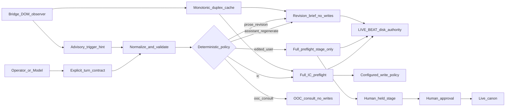

# Operator revision reliability and thread archival

Plan-of-record destination after approval: [`scarlett-guardian-mcp/docs/fable-5-roadmaps-audits/wp-ops-revision-and-archive-plan-2026-07-22.md`](scarlett-guardian-mcp/docs/fable-5-roadmaps-audits/wp-ops-revision-and-archive-plan-2026-07-22.md).

## Executive summary

Guardian currently has no logical-turn or revision identity. [`server.ts:27-59`](scarlett-guardian-mcp/src/guardian/server.ts) accepts only the latest user text, optional previous Scarlett text/context, retrieval breadth, and thread key; [`preflight.ts:273-304`](scarlett-guardian-mcp/src/guardian/tools/preflight.ts) resolves duplex and then treats every request as an ordinary Benjamin IC turn. The auditor can emit a transition and candidate update, and [`memory-writeback.ts:385-480`](scarlett-guardian-mcp/src/guardian/memory-writeback.ts) can stage it; ordinary beat stages may also auto-approve under current configuration. A prose rewrite or UI regeneration can therefore consume sidecar state, create duplicate/stale stages, or advance canon even though no scene advanced.

The recommended architecture adds an explicit two-axis contract:

- `turn_kind`: `ic | ooc_consult | prose_revision | ic_regen`
- `revision_surface`: `none | edited_user | assistant_regenerate | later_ooc_request`

It also carries `turn_kind_source`, `logical_turn_id`, user/assistant hashes, `revision_seq`, and `duplex_role`. Explicit caller/header intent is authoritative; bridge/UI detection and NLP are advisory only and may suppress writes but never enable them. `prose_revision` and assistant regeneration are deterministic no-write/no-transition paths. An edited Benjamin turn may rerun full continuity and create a provenance-tagged transition stage, but it must always be held for human review regardless of live/auto-approve configuration.

The browser bridge cannot prove why an assistant bubble changed. [`guardian-browser-bridge.user.js:296-369`](scarlett-guardian-mcp/scripts/guardian-browser-bridge.user.js) can only infer a stable substantial final observation. It therefore remains an observe-only final-hash transport, augmented with correct chat IDs, per-thread monotonic sequencing, server-owned timestamps/hashes, and removal of unsafe cross-thread seeding.

Archival follows the selected phased approach: first restore one-click loaded-thread download; later add an authenticated Guardian endpoint that writes reviewed raw archives under `backups/threads/`. Raw exports and the optional JSONL preflight spine remain outside `project_source_files` and are never indexed automatically.

## Current behavior audit

### A. Edited Benjamin message

- Grok creates/replaces a branch, but the current bridge watches assistant DOM mutations only and has no trustworthy edit event or logical turn ID.
- Preflight receives the edited `user_message`; duplex can still be the Scarlett reply to the pre-edit text because caller/cache text is not bound to a user hash.
- Full IC retrieval, dramaturg/serendipity side effects, Director correction, scene-transition assessment, NPC updates, and write-back can all rerun.
- Failure modes: mixed-branch critique, stale transition stage, duplicate ordinary beat write, and prior auto-approved output that classification cannot undo.

### B. UI Regenerate on Scarlett

- The same Benjamin turn is replayed, but there is no server-visible distinction from normal IC.
- [`duplex-cache.ts:71-103`](scarlett-guardian-mcp/src/guardian/duplex-cache.ts) replaces the thread entry by design; it has no generation ordering or logical-turn binding.
- The bridge waits for a quiet window and streaming-control absence, then posts a changed hash, but a long pause, selector drift, or out-of-order request can still publish an older observation.
- Failure modes: duplicate retrieval/write side effects, partial/stale cache replacement, wrong selected response branch, and correction of a response that is being replaced.

### C. Later OOC prose rewrite

- If sent through normal preflight, “make her softer” is embedded in retrieval as a Benjamin turn by [`preflight.ts:167-207`](scarlett-guardian-mcp/src/guardian/tools/preflight.ts), so meta text can drive scene state and write-back.
- [`ooc-consult.ts:11-95`](scarlett-guardian-mcp/src/guardian/tools/ooc-consult.ts) is write-safe, but it has no prose-revision mode, target reply, target hash, or revision-specific brief.
- Failure modes: false high-risk triggers, false LIVE BEAT correction, accidental scene stage, and substantial OOC responses poisoning duplex.

### D. LIVE BEAT lag reality

[`current-state.md:1-15`](rag-memory-mcp/project_source_files/current-state.md) remains the live authority. The latest report, [`preflight-full-2026-07-21T03-53-39-524Z.json`](scarlett-guardian-mcp/docs/guardian-reports/preflight-full-2026-07-21T03-53-39-524Z.json), detected a real cabin-to-suite transition but held an invalid rewrite for review. Until approval, subsequent preflights still read the older cabin LIVE BEAT. The pending stage is not canon and must not be treated as a retrieval overlay.

## Policy matrix

### Normal IC
- Full preflight: yes.
- Duplex: expected after the first turn; `duplex_role=prior_turn`.
- Scene transition: allowed against LIVE BEAT.
- Memory/NPC write: existing stage policy; auto-approval remains a separate configured policy.
- Wrong-location correction: allowed when the previous Scarlett reply conflicts with LIVE BEAT.
- Brief: normal IC continuity brief.
- Cache: final substantial reply creates the next prior-turn entry.

### Edited Benjamin regeneration
- Full preflight: yes, against edited text and current LIVE BEAT.
- Duplex: optional revision target; mark `duplex_role=superseded_branch`, never chronological canon.
- Scene transition: allowed only with supported real movement.
- Memory/NPC write: stage-only and always `held_for_review`; force-disable live append and every auto-approve path.
- Wrong-location correction: may critique the superseded reply, but must not treat its claimed location as canon.
- Brief: IC continuity plus explicit edited-branch warning.
- Cache: only the final regenerated Scarlett observation replaces that logical turn; monotonic sequence required.

### Assistant UI regeneration
- Full preflight: yes if the model invokes it, but in revision mode with idempotent reuse where possible.
- Duplex: revision target, not prior chronological turn.
- Scene transition: forbidden deterministically.
- Memory/NPC write: always `none`; skip dramaturg turn bump, serendipity persistence, and other narrative side effects.
- Wrong-location correction: advisory against the reply under edit only; it cannot advance LIVE BEAT.
- Brief: same-beat revision constraints, style/autonomy correction, no relocation.
- Cache: coalesce to newest stable hash; reject stale sequence with 409.

### Later OOC prose rewrite
- Full preflight: focused revision retrieval, not normal IC orchestration.
- Duplex: required target text/hash for v1; initially support the immediately previous Scarlett reply.
- Scene transition: forbidden deterministically.
- Memory/NPC write: always `none`; no sidecar advancement.
- Wrong-location correction: compare against target-turn anchor when available; without an anchor, return a non-blocking continuity warning rather than forcing current LIVE BEAT onto historical prose.
- Brief: revision-only constraints and requested delta; Guardian does not itself author Scarlett prose.
- Cache: the eventual full revised IC response may replace the target; the short OOC request/answer never enters duplex.

### Hard OOC systems consult
- Full preflight: no; use `guardian_ooc_consult`.
- Duplex: not required.
- Scene transition and memory/NPC write: forbidden.
- Wrong-location correction: no Director correction; return system/fact guidance.
- Brief: OOC answer only.
- Cache: never update from OOC output.

## Recommended architecture

Implementation rules:

1. Normalize omitted fields to `turn_kind=ic`, `revision_surface=none` for backward compatibility and emit the source as `default`.
2. Add a compact operator header/token as the deterministic interim transport; Guardian strips it before retrieval. Explicit API args override headers. Bridge/NLP hints can only select a safer no-write path or warn about ambiguity.
3. Apply policy before dramaturg counters, serendipity selection, LLM write decisions, and NPC mutation. Prompt instructions are secondary defense, not the write gate.
4. Include the contract in report models, brief compilation, eval inputs, telemetry enums/hashes, and stage rationale.
5. Add logical-turn idempotency keyed by thread, normalized user hash, revision surface, and LIVE BEAT hash; do not rely on a short time window alone.
6. Harden duplex transport: parse Grok’s `chat` query parameter, keep per-thread hashes, recompute SHA-256 server-side, use server receive time for TTL, add sequence/observation IDs, coalesce pending posts, and remove automatic cross-thread last-good seeding.
7. Preserve the WP-R1 200-character/structure floor, but add explicit OOC exclusion because long OOC text can pass the floor.

## Work packages

### OPS-REV-0 — Operator contract and safe-revision runbook (S, must-have)
- Goal: provide a no-code safe path immediately.
- Scope: v5 OOC prefix, explicit turn-kind/header examples, “How to regenerate safely,” staged-junk recovery, and project/skill wording.
- Likely files: [`single-agent-ooc-prefix-v4.txt`](rag-memory-mcp/docs/single-agent-ooc-prefix-v4.txt), [`grok-test-setup-and-ooc-continuation-2026-07-15.md`](scarlett-guardian-mcp/docs/grok-test-setup-and-ooc-continuation-2026-07-15.md), a new operator runbook, and active Guardian instruction text.
- Acceptance: templates distinguish all five policy rows; prose revision cannot be mistaken for scene advance; runbook documents `review:staged list/show/diff/reject`; no secrets or raw narrative are added.
- Risk/rollback: instruction drift; revert documentation version and retain v4.
- Depends on: none.

### OPS-REV-1 — Turn contract and deterministic write safety (M, must-have, recommended first code WP)
- Goal: make revision semantics explicit and enforce no-write/held-stage behavior in code.
- Scope: schemas/types, precedence/normalization, duplex roles, early side-effect gates, stage provenance, report output, and idempotency.
- Likely files: [`server.ts`](scarlett-guardian-mcp/src/guardian/server.ts), [`preflight.ts`](scarlett-guardian-mcp/src/guardian/tools/preflight.ts), [`memory-writeback.ts`](scarlett-guardian-mcp/src/guardian/memory-writeback.ts), [`models.ts`](scarlett-guardian-mcp/src/guardian/report/models.ts), relevant config and tests.
- Acceptance: omitted fields preserve normal IC; `prose_revision` and assistant regeneration always produce `scene_transition=null`, `memory_write.action=none`, no NPC write, no dramaturg/serendipity advance; edited-user transitions are always held with provenance even under live/auto-approve settings; repeated logical turn does not duplicate a write.
- Commands: `npm run build && npm test && npm run eval:fast`.
- Risk/rollback: caller misclassification suppresses a legitimate write; rollback behind a feature flag while preserving report-only fields.
- Depends on: OPS-REV-0 contract frozen.

### OPS-REV-2 — Bridge finality, identity, and ordering (M, must-have)
- Goal: ensure cache contains the newest stable substantial reply for the correct chat without claiming DOM certainty.
- Scope: correct chat key, per-thread state, server-owned hash/time, monotonic sequence and 409 rejection, post coalescing/retry, explicit OOC exclusion, and removal of cross-thread seed.
- Likely files: [`guardian-browser-bridge.user.js`](scarlett-guardian-mcp/scripts/guardian-browser-bridge.user.js), [`duplex-cache.ts`](scarlett-guardian-mcp/src/guardian/duplex-cache.ts), [`server.ts`](scarlett-guardian-mcp/src/guardian/server.ts), DOM/cache/HTTP fixtures.
- Acceptance: partial-then-final and out-of-order cases resolve to the final hash; `?chat=<uuid>` isolates chats; identical content in two chats is valid; future client timestamps do not extend TTL; stale sequences and hash mismatches are rejected; bridge failure remains fail-open.
- Commands: Guardian build/test/eval plus supervised live selector checks.
- Risk/rollback: Grok DOM drift; retain current stable observer behind versioned userscript flag.
- Depends on: OPS-REV-1 metadata contract.

### OPS-REV-3 — Revision-aware auditor and brief (M, must-have)
- Goal: critique the reply under edit while freezing location/time and avoiding false Director pressure.
- Scope: mode-specific evidence labels and prompts, revision brief compiler, target-turn anchor handling, OOC consult routing; no prose generation inside Guardian.
- Likely files: [`llm-assessment.ts`](scarlett-guardian-mcp/src/guardian/llm-assessment.ts), brief compiler/report models, [`ooc-consult.ts`](scarlett-guardian-mcp/src/guardian/tools/ooc-consult.ts), prompt tests.
- Acceptance: revision prompts cannot emit actionable transitions/writes after normalization; same-beat style changes preserve LIVE BEAT; an unanchored historical target yields a warning rather than a forced relocation; normal IC prompt output remains unchanged.
- Commands: `npm run build && npm test && npm run eval:fast`; with a configured key, `npm run eval:llm -- --category duplex,write-back --trials 3` plus the new revision category.
- Risk/rollback: prompt regression; code gates remain authoritative while reverting prompt text.
- Depends on: OPS-REV-1.

### OPS-REV-4 — Goldens, telemetry, and dashboard visibility (S/M, must-have)
- Goal: prove policy and measure revision behavior without storing raw prose in telemetry.
- Scope: add a `revision` golden category/input expectations; turn-kind/surface/source, suppression reason, revision rate, staged-from-revision count, cache sequence outcomes, and hashed anchors.
- Likely files: [`evals/schema.ts`](scarlett-guardian-mcp/evals/schema.ts), runner/expectations/goldens, [`telemetry.ts`](scarlett-guardian-mcp/src/guardian/telemetry.ts), dashboard summaries, test suites.
- Acceptance: goldens cover all five policy rows, stale pending state not becoming LIVE BEAT, duplicate-write prevention, and no raw user/assistant text in telemetry; frozen cassettes remain unchanged.
- Commands: `npm run build && npm test && npm run eval:fast`; targeted LLM eval for prompt changes.
- Risk/rollback: schema/dashboard compatibility; bump telemetry schema and retain old-event parsing.
- Depends on: OPS-REV-1 through OPS-REV-3.

### OPS-REV-5 — Human-gated multi-beat catch-up bundle (L, sibling/deferred)
- Goal: recover when approved LIVE BEAT lags several scenes without weakening disk authority.
- Scope: one bundle with ordered event-log append, final current-state overwrite, optional arc-plan update, per-target base hashes, repeated Guardian validation, atomic approval, and durable promotion receipt.
- Likely files: Guardian transition/state-rewrite code and RAG staging server/CLI/tests in both repositories.
- Acceptance: approval fails on base drift; all targets apply or none; unresolved threads must be preserved/resolved explicitly; pending bundles never enter retrieval; reindex remains separate and explicit.
- Risk/rollback: cross-file transaction complexity; retain current single-stage workflow and manual emergency rewrite.
- Depends on: revision provenance from OPS-REV-1; RAG-side design ACK.

### ARCH-1A — One-click loaded-thread download (M, must-have archival v1)
- Goal: immediately reduce platform-loss risk with a manual browser download.
- Scope: modernize the legacy exporter inside or beside Bridge v2; Markdown and JSONL; stable ordering, role/hash/ordinal metadata, repeated text retained, completeness/bubble-count summary, sanitized filename.
- Acceptance: one menu action exports all currently loaded human/assistant bubbles in order; reload fixture round-trip passes; output is clearly labeled “loaded thread export” when full-history loading cannot be proven.
- Risk/rollback: selector drift/virtualization; keep legacy exporter available and never claim completeness without verification.
- Depends on: OPS-REV-2 shared DOM identity where practical.

### ARCH-1B — Authenticated repository archive endpoint (M/L, later archival phase)
- Goal: make “mark for archiving” write a bounded snapshot under `backups/threads/` without manual file movement.
- Scope: authenticated chunked upload, path sanitization, deterministic archive ID/hash, optional Markdown rendering, freeze/rename metadata, durable receipt, no index hook.
- Acceptance: auth is mandatory; traversal/oversize/malformed chunks fail; restart-safe idempotency; output lands only in the raw backup tree; nothing touches `project_source_files` or a vector store.
- Risk/rollback: sensitive data at rest and tunnel exposure; disable route and retain ARCH-1A downloads.
- Depends on: ARCH-1A format proven; explicit retention/access policy ACK.

### ARCH-2 — Possible-truncation warning (S/M, nice-to-have)
- Goal: warn when a stable thread observation loses bubbles without overwriting last-good evidence.
- Scope: per-thread count and ordered role/hash manifest, multiple stable scans, loading suppression, operator acknowledgement for a shorter baseline.
- Acceptance: fixtures distinguish loading dips from stable count loss; warning says “possible truncation or branch revision”; edited branches do not silently replace the last-good manifest.
- Risk/rollback: false alarms after legitimate branch edits; advisory-only pill and reset control.
- Depends on: ARCH-1A fingerprint format and OPS-REV-2 thread key.

### ARCH-3 — Opt-in Guardian JSONL spine (M, nice-to-have)
- Goal: retain a partial server-side recovery spine for preflight turns.
- Scope: append-only, schema-versioned records containing server timestamp, report/logical-turn IDs, turn kind, raw user + resolved duplex, hashes, and dedupe key; separate from telemetry.
- Acceptance: restart-safe append/dedupe; explicitly documents gaps; disabled by default; never indexed automatically.
- Risk/rollback: raw sensitive prose at rest; disable capture and preserve existing files under retention policy.
- Depends on: OPS-REV-1 IDs and ARCH-1B storage policy.

## Sequencing

- Docs-only before further play: OPS-REV-0. It can ship independently and documents review/reject recovery for suspicious revision stages.
- First implementation after explicit “go”: OPS-REV-1, because current ordinary beat auto-approval makes classification a write-safety issue.
- Revision reliability v1: OPS-REV-1 → OPS-REV-2 → OPS-REV-3 → OPS-REV-4.
- Archival v1 can follow bridge identity work: ARCH-1A, then ARCH-2. ARCH-1B and ARCH-3 follow only after raw-data retention/auth policy is frozen.
- After the HQ set piece: OPS-REV-5 and RAG stage-bundle work; do not block current play or weaken LIVE BEAT meanwhile.

## Operator ACK gates and defaults to freeze

- Accepted default: ARCH-1 is phased—browser download first, authenticated repository endpoint later.
- Accepted default: edited-Benjamin regeneration may create only a provenance-tagged held stage; never auto-approve.
- Proposed default: v1 prose revision targets only the immediately previous Scarlett reply; arbitrary historical-message revision is deferred until stable message IDs exist.
- Proposed default: explicit args/header outrank all hints; NLP/DOM ambiguity can suppress writes but never enable them.
- Proposed default: raw archive retention is opt-in, local-only, and excluded from indexing; ARCH-1B/3 remain blocked until retention/access details are acknowledged.
- “Accept plan” authorizes writing this plan document only. Code, canon edits, stage approval/rejection, reindexing, PRs, and WP implementation remain forbidden until the Operator separately says “go” and names the WP.

## Explicit deferrals

- Full arbitrary-message revision graph.
- Silent approval of current-state or catch-up bundles.
- Pending-stage retrieval overlays or timestamp-based weakening of LIVE BEAT.
- Automatic raw-thread indexing.
- Living GM/offline proposal log, personhood-agent restoration, and Affalterbach narrative content.
- Any platform API or scraper behavior not available through the current Tampermonkey-visible DOM and local Guardian.

Ready for Operator ACK. Recommended first implementation WP after a separate “go”: OPS-REV-1.