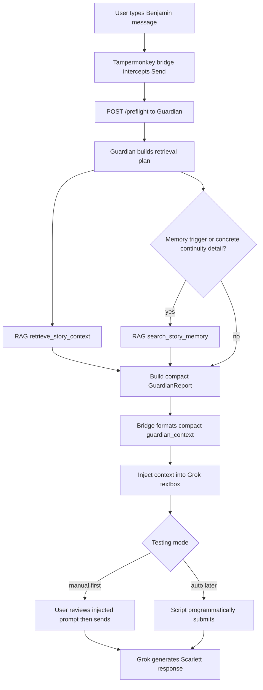

# Guardian Workflow Simplification

Date: 2026-06-23

## Current Opinion

The project should be simplified before chasing further browser-bridge bugs.

The backend works: Guardian can receive a message, call RAG, and generate a report. The fragile part is the handoff between Grok/browser and Guardian, plus the amount of context injected back into Grok.

For now, prioritize a small reliable preflight over a maximal report.

## Recommended Temporary Preflight

Disable or avoid expensive layers during normal browser-bridge testing:

- Disable LLM assessment.
- Do not auto-expand chunks unless explicitly requested.
- Do not auto-run fact checks unless explicitly requested.
- Keep `force_full_retrieval: false`.
- Retrieve only enough memory to ground the next turn.

Minimal first-pass report:

1. `retrieve_story_context` once.
2. `search_story_memory` once if the message contains a memory trigger or concrete continuity detail.
3. Build a compact Guardian report.
4. Inject only the compact report into Grok.

This makes the system faster, cheaper, and easier to debug.

## Workflow Diagram

## Where The Slowdown Comes From

The slowdown is not mainly from the user's message length.

Likely slow points:

- vector-store retrieval
- multiple `search_story_memory` calls
- optional `expand_context_around_chunk`
- optional `verify_story_fact`
- optional LLM assessment
- large report serialization
- Grok processing a large injected context block

## Tool Visibility

Current simple setup:

- RAG connector: 4 tools is correct if RAG is directly connected:
  - `get_live_story_state`
  - `index_status`
  - `retrieve_story_context`
  - `search_story_memory`
- Guardian connector: 1 tool is correct for the stable MVP:
  - `guardian_memory_preflight`

Recommended Grok setup right now:

- Enable Guardian.
- Disable direct RAG unless deliberately testing RAG.
- Let Guardian call RAG internally.

If the current development branch exposes `guardian_ooc_consult`, Guardian may show 2 tools. That is okay for development, but it is not required for the browser bridge.

## OpenAI Agents SDK Opinion

OpenAI Agents SDK could be useful later if the project moves toward a proper orchestrated local agent that owns:

- retrieval planning
- tool calling
- diagnostics/tracing
- report generation
- postflight review queues

But switching now would add another migration while the fragile part is still the browser bridge. The immediate problem is not lack of an agent framework; it is:

- message capture
- prompt injection
- report size
- submit behavior
- observability

Recommendation:

1. Finish the current Guardian + browser bridge in minimal mode.
2. Add better diagnostics.
3. Only then consider OpenAI Agents SDK as a cleaner orchestration layer.

## Immediate Next Steps

1. Disable LLM assessment for normal preflight.
2. Keep browser bridge in manual-submit mode.
3. Compact injected Guardian context to under roughly 1,500-2,000 characters.
4. Verify the text box contains exactly:
   - the original user message
   - a short `<guardian_context>` block
5. Manually send.
6. Re-enable auto-submit only after manual mode works.
