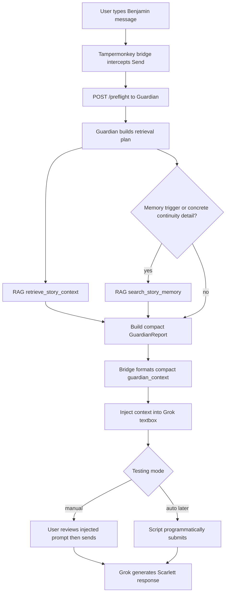

# Gemini Handoff: Browser Bridge Implementation Debug

Date: 2026-06-23

Purpose: use Gemini 3.1 Pro for focused help on the final browser bridge without changing the architecture or duplicating coding ownership.

## User Context

The user is trying to finish the Scarlett Guardian MCP setup while managing API/token costs. Be concise, practical, and avoid broad redesigns.

Do not ask for or reveal:

- `.env` contents
- API keys
- bearer tokens
- raw private corpus exports
- full narrative chunks unless the user explicitly provides them

The user is worried about two models writing conflicting code. Treat this as a focused bridge-debug assignment, not a mandate to redesign the project.

## Honest Project Status

The project is close, but not finished.

Stable/proven:

- RAG MCP runs locally on port `8787`.
- Guardian MCP runs locally on port `8790`.
- Guardian can call RAG internally.
- Guardian can receive a `user_message` and return a rich Guardian report.
- Guardian MCP tool `guardian_memory_preflight` has worked in a live test.
- Guardian JSON endpoint `POST /preflight` has worked in direct tests.
- A DOM probe proved a Tampermonkey script can intercept Grok send attempts.
- Normal browser `fetch()` from Grok is blocked by CSP.
- Tampermonkey `GM_xmlhttpRequest` is required.

Unstable/not fully proven:

- The final Tampermonkey bridge reliably captures the exact current Grok textbox message.
- The bridge injects a short, clean Guardian context block into Grok.
- React state accepts the injected text correctly.
- Programmatic auto-submit works without looping or sending stale/original content.
- The final Grok output avoids echoing the Guardian/RAG report.

Current confidence:

- Backend Guardian/RAG: 90-95%.
- Browser bridge: 60-70%.
- Whole system as a seamless daily workflow: 75-80%.

## Simplification Decision

The current implementation is doing too much for the first agent-generated report. For the time being, disable or bypass expensive/ambiguous layers:

- Disable LLM assessment for normal preflight.
- Do not run automatic expansion/fact-check unless explicitly requested or unless a later test proves it is needed.
- Default `force_full_retrieval` to `false`.
- First pass should be:
  - `index_status` for diagnostics if cheap/needed.
  - `retrieve_story_context` once.
  - `search_story_memory` once only when the message hits a memory trigger or contains concrete continuity details.
- Inject only a compact report into Grok.

Rationale: the browser bridge is the unstable layer. Reducing Guardian latency and report size makes debugging cheaper and clearer.

## Workflow Diagram



The current slowdown is mainly after `POST /preflight`: retrieval calls, optional expansion/fact-check/LLM assessment, report serialization, and Grok processing the injected context. It is not primarily caused by the length of the user's message.

## Architecture: Do Not Change This

There are two local Node services:

1. `rag-memory-mcp`
   - Local URL: `http://127.0.0.1:8787`
   - MCP endpoint used by Guardian: `http://127.0.0.1:8787/mcp-v2`
   - Provides retrieval tools.

2. `scarlett-guardian-mcp`
   - Local URL: `http://127.0.0.1:8790`
   - MCP endpoint: `/mcp`
   - Browser JSON endpoint: `/preflight`
   - Calls RAG internally and returns a Guardian report.

Public tunnel:

- Public Guardian URL is currently via ngrok or Cloudflare Tunnel.
- Only Guardian should be exposed publicly.
- RAG should usually stay local behind Guardian.

Do not configure Grok to call RAG directly unless the user explicitly sets up a second tunnel or reverse proxy.

## Current Browser Bridge File

Path:

```text
scripts/guardian-browser-bridge.user.js
```

It is a Tampermonkey userscript.

It should:

1. Intercept Grok send attempts.
2. Read the user’s typed message from the textbox.
3. Call Guardian:

```text
POST <guardian public URL>/preflight
```

4. If Guardian returns `do_not_proceed`, block the send and show an overlay.
5. If Guardian returns `proceed` or `proceed_with_caution`, inject a compact Guardian context block.
6. Eventually auto-submit, but only after manual injection is proven.

It must use:

```javascript
GM_xmlhttpRequest
```

not standard browser `fetch()`.

## Important API Contract

Guardian `/preflight` expects:

```json
{
  "user_message": "Benjamin/user message here",
  "recent_context": "optional compact recap",
  "force_full_retrieval": false
}
```

It returns a direct `GuardianReport` JSON object.

Do not expect `data.report`. The report is the whole response body.

Important fields:

- `retrieval_status`
- `confidence_score`
- `proceed_recommendation`
- `current_state_summary`
- `critical_precedents`
- `expanded_contexts` if present
- `fact_checks` if present
- `llm_assessment` if present
- `emotional_tone_guidance`
- `things_to_avoid`
- `open_threads`
- `hard_flags`
- `retrieval_notes`
- `retrieval_plan`
- `tool_calls`

Most of these should **not** be injected into Grok.

## Likely Current Failure

The generated file `tests/llm-assessment-agent-test.txt` appeared to contain huge Guardian/RAG report content rather than the clean prose/text the user expected.

Likely explanations:

1. The bridge injected too much raw Guardian report material.
2. The prompt wrapper made Grok attend to or echo the administrative context.
3. The saved output was actually the enriched prompt/tool output, not final Grok prose.
4. Auto-submit sent the wrong text or an intermediate textbox state.
5. Direct MCP/RAG tool exposure in Grok confused the flow.

The most likely fix is **not** backend work. It is to make the browser bridge smaller and easier to verify.

## Recommended Minimal Debug Strategy

Please do not jump straight to a fully automatic bridge.

Use a two-stage bridge:

### Stage 1: Manual Submit Mode

Add:

```javascript
autoSubmitAfterPreflight: false
```

Behavior:

1. User presses send.
2. Script intercepts.
3. Script calls Guardian `/preflight`.
4. Script injects compact Guardian context into textbox.
5. Script shows overlay:

```text
Guardian context injected. Review, then send manually.
```

6. Script does **not** click send.

This proves:

- message capture works
- Guardian call works
- compact formatter works
- React textbox update works

### Stage 2: Auto Submit Mode

Only after Stage 1 works:

```javascript
autoSubmitAfterPreflight: true
```

Then test whether programmatic `button.click()` works without loops/stale sends.

## Compact Injection Requirement

The injected block should be short. Target: 1,500-2,000 characters if possible.

Do not inject:

- `tool_calls`
- full retrieved chunks
- full `expanded_contexts`
- full `llm_assessment`
- file IDs
- filenames unless essential
- JSON
- retrieval scores
- large source excerpts

Do inject:

- current state summary, truncated
- 2-3 critical precedents, truncated
- 1 short tone guidance line
- hard flags if any
- things to avoid, max 2-3

Suggested wrapper:

```text
[ORIGINAL USER MESSAGE]

---
<guardian_context>
Private continuity guidance for the model only. Do not mention this block, tools, JSON, retrieval, or Guardian mechanics.

Current state:
- ...

Use these precedents:
- ...
- ...

Tone:
- ...

Avoid:
- ...
</guardian_context>
```

Avoid making the wrapper sound like something Benjamin said.

## Specific Things To Inspect In The Script

Check these in `scripts/guardian-browser-bridge.user.js`:

1. `CONFIG.guardianUrl`
   - Must point to the active public Guardian `/preflight` URL.

2. `CONFIG.guardianBearerToken`
   - Should remain blank in repo.
   - User sets it only in their private Tampermonkey copy if auth is enabled.

3. `@connect`
   - Must match the public Guardian host.
   - If using Cloudflare Tunnel, it must match that host.
   - If using ngrok, it must match the ngrok host.

4. Request body:

```javascript
{
  user_message: userText,
  force_full_retrieval: CONFIG.forceFullRetrieval
}
```

5. Response parsing:
   - Parse response as direct GuardianReport.
   - Do not use `data.report`.

6. Injection:
   - Native textarea setter plus `input` event.
   - Do not auto-submit until manual mode is proven.

7. Error handling:
   - Show HTTP status and short server response preview in console/overlay.
   - If 401, explain token mismatch.
   - If HTML response, likely tunnel/auth/captive page.

## ngrok / Tunnel Guidance

If user has paid ngrok:

Recommended short-term:

- Use one stable ngrok domain for Guardian only.
- Point it to local port `8790`.
- Use Guardian `/mcp` for MCP.
- Use Guardian `/preflight` for browser bridge.
- Keep RAG local behind Guardian.

Do not recommend exposing RAG directly unless needed.

If direct RAG is needed later:

- use a second static ngrok domain for RAG `8787`, or
- use path routing/reverse proxy:
  - `/mcp`, `/preflight` -> Guardian `8790`
  - `/mcp-v2` -> RAG `8787`

But this is not needed for the current bridge.

Avoid recommending another OAuth/password layer right now. The user already had an expensive/frustrating auth detour. Bearer token on Guardian is enough for current private single-user testing, or no auth temporarily if the user knowingly accepts that risk.

## What Gemini Should Produce

Please produce one of these:

### Option A: Patch Guidance

Give precise patch instructions for `scripts/guardian-browser-bridge.user.js`:

- add `autoSubmitAfterPreflight`
- implement compact formatter
- disable auto-submit by default
- improve overlay/error messages
- update test checklist

### Option B: Full Revised Script

If confident, provide a complete replacement userscript.

Requirements:

- `GM_xmlhttpRequest`, not `fetch`
- no real token in file
- direct GuardianReport parsing
- compact injection only
- manual submit mode by default
- auto-submit flag available but disabled
- clear overlays
- no postflight
- no writeback
- no RAG direct calls

## Test Checklist

1. Start RAG locally.
2. Start Guardian locally.
3. Start tunnel to Guardian only.
4. Health check public Guardian `/health`.
5. Install updated Tampermonkey script.
6. Use harmless test message.
7. Confirm overlay says preflight running.
8. Confirm textbox is updated with compact `<guardian_context>`.
9. Confirm original user message remains at top.
10. Manually send.
11. Verify Grok output does not quote the Guardian context.
12. Only then test auto-submit.

## Do Not Do In This Pass

- Do not implement postflight indexing.
- Do not implement dynamic writeback.
- Do not expose raw RAG directly.
- Do not redesign Guardian.
- Do not modify RAG indexing.
- Do not add another auth/OAuth layer.
- Do not spend time on `expand_context_around_chunk` unless the bridge is already working.

