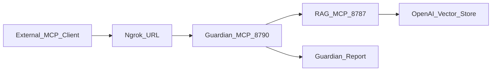

# Guardian MCP Remote Flow Handoff

Date: 2026-06-22

Purpose: supplemental context for another model/API session. This packet is documentation-only and excludes `.env`, API keys, bearer tokens, raw narrative documents, vector-store exports, and private corpus chunks.

## Current Status

- Completion estimate: 95%.
- Branch: `guardian-remote-hardening`.
- Latest Guardian commit: `af4663f Harden Guardian MCP remote access`.
- Working Guardian repo was clean after the commit.
- The Guardian MCP remote flow has been implemented, hardened, documented, and smoke-tested locally and through ngrok.
- Remaining work is operational rather than core implementation: push the branch when desired, decide whether ngrok remains temporary or is replaced by a stable host, and keep the separate RAG repo's unrelated dirty tree out of this Guardian work.

## What Was Built

- `scarlett-guardian-mcp` is a TypeScript HTTP MCP server.
- It exposes one primary tool: `guardian_memory_preflight`.
- It also exposes `POST /preflight`, a plain JSON endpoint for future browser/Tampermonkey bridges.
- It wraps the existing `rag-memory-mcp` service rather than replacing it.
- Current MVP assumption: the external MCP client/model passes Benjamin's latest message into `guardian_memory_preflight`.
- It calls RAG tools in this order:
  - `index_status`
  - `retrieve_story_context`
  - `search_story_memory`
- It returns a structured Guardian report with retrieval status, confidence score, proceed recommendation, current state summary, precedents, tone guidance, hard flags, retrieval notes, retrieval plan, and full RAG tool-call trace.

## Runtime Flow

## Confirmed Validation

- Guardian build passed: `npm run build`.
- Guardian tests passed: `npm test`.
- RAG build passed: `npm run build`.
- RAG retrieval sanity query returned high-confidence context.
- Local Guardian `/health` returned shallow public status.
- Remote ngrok Guardian `/health` returned shallow public status.
- Local unauthenticated `/mcp` returned `401` with Guardian bearer auth configured.
- Remote unauthenticated `/mcp` returned `401` through ngrok.
- Local authenticated `guardian_memory_preflight` succeeded.
- Remote authenticated `guardian_memory_preflight` succeeded through ngrok.
- Both real MCP smoke tests listed `guardian_memory_preflight` and returned successful required RAG tool calls.

## Current Endpoints

- RAG health: `http://127.0.0.1:8787/health`
- RAG MCP used by Guardian: `http://127.0.0.1:8787/mcp-v2`
- Guardian health: `http://127.0.0.1:8790/health`
- Guardian MCP local: `http://127.0.0.1:8790/mcp`
- Guardian MCP via ngrok: `https://deceiving-pummel-ajar.ngrok-free.dev/mcp`
- Guardian JSON preflight local: `http://127.0.0.1:8790/preflight`
- Guardian JSON preflight via ngrok: `https://deceiving-pummel-ajar.ngrok-free.dev/preflight`

## Important Env Vars

- `GUARDIAN_HOST=0.0.0.0`
- `GUARDIAN_PORT=8790`
- `GUARDIAN_MCP_BEARER_TOKEN=` must be set before public exposure.
- `RAG_MCP_URL=http://127.0.0.1:8787/mcp-v2`
- `RAG_MCP_BEARER_TOKEN=` only needed if RAG has `MCP_BEARER_TOKEN` set.
- `RAG_MCP_TIMEOUT_MS=30000`
- `GUARDIAN_CONFIDENCE_THRESHOLD=70`

Do not share real token values with external models.

## Startup Order

1. Start RAG from `rag-memory-mcp`.
2. Start Guardian from `scarlett-guardian-mcp`.
3. Start ngrok pointing at Guardian port `8790`.
4. Configure the external MCP client to use Guardian's `/mcp` endpoint with the bearer header.

## Share Packet Contents

- `OVERVIEW_STATUS.md`: this concise status and handoff summary.
- `README.md`: current Guardian setup, runbook, auth, ngrok, tool contract, and smoke-test expectations.
- `finish_guardian_mcp_89229459.plan.md`: completed Cursor plan with all todos marked complete.
- `proposal.md`: original architectural proposal for an external Guardian MCP server.
- `guardian-model-instructions.md`: model-facing instructions for mandatory Guardian preflight behavior.
- `prompt_for_gpt55_scarlett_guardian_mcp.md`: earlier implementation prompt/context; useful historically, but some tool-list details are stale.

## Caveats

- The live RAG service is `rag-memory-mcp`, not stale root-level RAG files.
- Current RAG tools are `retrieve_story_context`, `search_story_memory`, `get_live_story_state`, and `index_status`.
- Older docs may mention planned tools such as `expand_context_around_chunk` and `verify_story_fact`; those are not exposed by the current live RAG source.
- The separate `rag-memory-mcp` git repo had unrelated dirty/deleted docs/backups during this work and was intentionally not modified as part of the Guardian hardening commit.
- The current integration still relies on the generating model/client to call Guardian with the latest user message. A later hardening pass should remove that dependency by capturing the latest browser-authored message outside the model loop, for example with a Tampermonkey/browser script adapted from the thread-export workflow that writes the last user message to a watched local folder for a small Guardian bridge to consume.
- A bridge-ready `POST /preflight` endpoint now exists so a browser script can call Guardian directly without speaking MCP. The future browser script still needs to be built and tested against the target web UI.

## Completion Estimate

- Core Guardian implementation: complete.
- Remote hardening: complete.
- Local and ngrok smoke testing: complete.
- Documentation packet: complete.
- Overall: 95%.

Remaining 5%:

- Push the Guardian branch if desired.
- Decide whether to keep ngrok or move to a persistent deployment.
- Upgrade the latest-message capture path so Guardian receives the browser-authored turn without relying on model compliance.
- Optionally clean up stale RAG docs/tool references in a separate RAG-focused branch.
