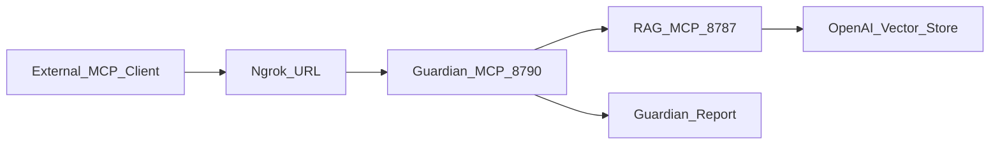

# Finish Guardian MCP Remote Flow

## Current Position

The local stack is healthy: RAG responds on `127.0.0.1:8787`, Guardian responds on `127.0.0.1:8790`, and ngrok reaches Guardian. The live RAG service is `[rag-memory-mcp](rag-memory-mcp)`, while `[scarlett-guardian-mcp](scarlett-guardian-mcp)` is the Guardian wrapper that should be exposed.

The finish plan keeps OpenAI as the current working backend because Vector Stores are already live, while keeping model/provider decisions configurable. The provider question should be evaluated only against the intended nudity/ERP use case and current provider terms, not by guessing. No Grok integration is needed unless OpenAI blocks an intended workflow and Grok explicitly allows it.

## Implementation Plan

1. Create a clean checkpoint branch and commit boundary.
   - Inspect git state inside `[scarlett-guardian-mcp](scarlett-guardian-mcp)` and `[rag-memory-mcp](rag-memory-mcp)` separately.
   - Create or use a Guardian-focused branch such as `guardian-remote-hardening`.
   - Commit Guardian MVP/hardening work separately from the dirty RAG tree and do not commit `.env`, tokens, ngrok auth, backups, or unrelated deletions.

2. Harden Guardian before treating ngrok as usable externally.
   - Update `[scarlett-guardian-mcp/src/guardian/config.ts](scarlett-guardian-mcp/src/guardian/config.ts)` with `GUARDIAN_MCP_BEARER_TOKEN` and likely `RAG_MCP_TIMEOUT_MS`.
   - Protect `POST /mcp` in `[scarlett-guardian-mcp/src/guardian/server.ts](scarlett-guardian-mcp/src/guardian/server.ts)` with bearer auth when configured.
   - Keep `/health` public but shallow, removing detailed local URL/config leakage from the public response.
   - Add local `try/catch` handling around MCP request setup so transport failures return clean JSON instead of raw Express errors.
   - Add outbound timeout behavior in `[scarlett-guardian-mcp/src/guardian/rag-client.ts](scarlett-guardian-mcp/src/guardian/rag-client.ts)` so Guardian does not hang forever if RAG stalls.

3. Validate the actual MCP behavior, not just `/health`.
   - Run Guardian `npm test` and `npm run build`.
   - Run RAG `npm run build` and one retrieval sanity query from `[rag-memory-mcp](rag-memory-mcp)`.
   - Smoke-test Guardian locally by calling `guardian_memory_preflight` through `/mcp` and confirming the returned report includes successful `index_status`, `retrieve_story_context`, and `search_story_memory` calls.
   - Repeat the same smoke test through `https://deceiving-pummel-ajar.ngrok-free.dev/mcp` using the bearer token once auth is added.

4. Update docs and examples so the setup is repeatable.
   - Update `[scarlett-guardian-mcp/README.md](scarlett-guardian-mcp/README.md)` with startup order, health checks, bearer-token usage, ngrok URL format, and expected preflight success criteria.
   - Update `[scarlett-guardian-mcp/.env.example](scarlett-guardian-mcp/.env.example)` with the new auth/timeout variables.
   - Update MCP config examples in `[scarlett-guardian-mcp/.agents/mcp_config.json](scarlett-guardian-mcp/.agents/mcp_config.json)` and `[scarlett-guardian-mcp/examples/antigravity-mcp_config.json](scarlett-guardian-mcp/examples/antigravity-mcp_config.json)` if they need remote `serverUrl` and auth guidance.
   - Avoid relying on stale root RAG docs or root `src/`; use `[rag-memory-mcp](rag-memory-mcp)` as the source of truth.

5. Final verification and push-ready state.
   - Re-run builds/tests after docs/config changes.
   - Confirm ngrok `/health` returns only shallow status and `/mcp` rejects unauthenticated requests.
   - Confirm authenticated remote preflight succeeds and includes the required RAG tool-call trace.
   - Review git diff for secrets and unrelated files, then commit and push the Guardian branch when requested.

## Flow

## Completion Estimate

Current progress: about 60%.

After Guardian auth/error/timeout hardening: about 75%.

After local and ngrok MCP smoke tests pass: about 90%.

After docs, final diff review, commit, and optional push: 100%.