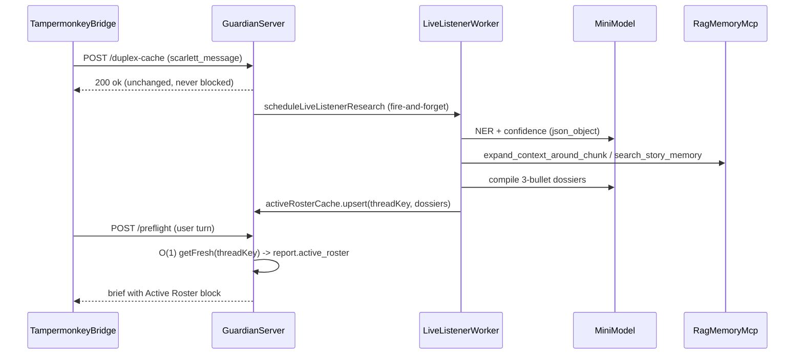

# Live Listener Implementation Plan

## Architecture decisions (as Principal Architect)

- **In-process worker, not a standalone daemon.** The proposal's `/duplex-cache` trigger wins over roadmap WP-8.2's log-tailing `scripts/live-listener.ts`. It reuses the proven `scheduleDramaturgRefresh` fire-and-forget pattern ([src/guardian/dramaturg.ts](scarlett-guardian-mcp/src/guardian/dramaturg.ts) 982–1044) and needs no second process.
- **TTL expiry, not flush-on-inject.** Flushing the cache at preflight (proposal §3E) breaks if Grok regenerates or the user idles; mirror `DuplexCache`'s TTL/`getFresh` semantics instead ([src/guardian/duplex-cache.ts](scarlett-guardian-mcp/src/guardian/duplex-cache.ts)).
- **Separate cheap model.** New `GUARDIAN_LISTENER_MODEL` (default `gpt-4o-mini`) so background NER never burns the `gpt-5.6-terra` auditor budget. Gate everything on `GUARDIAN_LISTENER_ENABLED` (default false) + `OPENAI_API_KEY`.
- **Two-lane dossier fetch.** Known NPCs (alias match in `DEFAULT_NPC_REGISTRY`) get an addressed `expand_context_around_chunk` fetch (RAG has no entity lookup — the name→section map lives Guardian-side in [scene-roster.ts](scarlett-guardian-mcp/src/guardian/scene-roster.ts)). Unknown entities get `search_story_memory` with `source_roles: ["npc_canon","story_bible","arc_chronicle"]`.

## New modules

### 1. `src/guardian/active-roster.ts` — the cache

- `ActiveRosterCache` class: `Map<threadKey, RosterEntry>` with `RosterEntry = { dossiers: Dossier[], updatedAtMs, sourceHash }` and `Dossier = { entity, confidence, bullets: string[], sources: {source_file, section}[] }`.
- `upsert`, `getFresh(threadKey, ttlMs)`, `clear` — process-wide singleton, same shape as `duplexCache`.
- Secondary per-entity memo (`entity → Dossier`, longer TTL ~2h) so recurring names aren't re-researched every turn.

### 2. `src/guardian/live-listener.ts` — the researcher worker

- `scheduleLiveListenerResearch({ threadKey, scarlettMessage })`: per-thread in-flight lock with coalescing (Dramaturg pattern); entire body wrapped so it can never throw into the caller.
- Pipeline inside the async worker, under one `AbortController` soft deadline (`GUARDIAN_LISTENER_TIMEOUT_MS`, default 20s):
  1. **NER:** `chat.completions.create` with `response_format: json_object` (copy the [query-planner.ts](scarlett-guardian-mcp/src/guardian/query-planner.ts) pattern), prompt returns `[{ entity, type, confidence }]` from the last turn. Fail-soft on parse errors.
  2. **Filter:** drop protagonists (Scarlett/Benjamin), confidence < threshold, entities with a fresh memo; cap 4 entities per run.
  3. **Fetch:** fresh `RagMcpClient` per run (preflight closes its own in `finally`), `pLimit(2)`; known-alias lane via `expand_context_around_chunk`, unknown lane via `search_story_memory` (max_results 4).
  4. **Summarize:** one mini-model call compiling ≤3 bullets per entity, hard cap ~350 chars/dossier — never raw RAG text.
  5. **Write** to `ActiveRosterCache`; emit telemetry.

## Integration points (existing files)

### 3. Trigger — [src/guardian/server.ts](scarlett-guardian-mcp/src/guardian/server.ts) (~line 464)

After `storeDuplexMessage` succeeds in `POST /duplex-cache`, call `scheduleLiveListenerResearch(...)` un-awaited. The 200 response and 422 gate behavior are untouched.

### 4. Injection — [src/guardian/tools/preflight.ts](scarlett-guardian-mcp/src/guardian/tools/preflight.ts)

After the duplex merge (`resolveDuplexInput`, lines 285–296): `activeRosterCache.getFresh(threadKey)` — a pure Map lookup, zero new RAG/LLM calls on the hot path. Attach as new optional `active_roster` field on `GuardianReport` ([report/models.ts](scarlett-guardian-mcp/src/guardian/report/models.ts)) so HTTP `/preflight` consumers see it too.

### 5. Brief render — [src/guardian/report/compile-grok-brief.ts](scarlett-guardian-mcp/src/guardian/report/compile-grok-brief.ts)

New optional `**Active Roster (background dossiers):**` block next to the Scene Cast block (~lines 241–253). Rules: **omitted entirely when empty** (keeps `eval:fast` goldens byte-identical), total block capped ~1200 chars, and rendered even in `isQuietPrivateCoupleScene` scenes — dossiers are historical grounding for *mentioned* entities, unlike present-cast Scene Cast.

### 6. Config — [src/guardian/config.ts](scarlett-guardian-mcp/src/guardian/config.ts) + `.env.example`

`GUARDIAN_LISTENER_ENABLED` (false), `GUARDIAN_LISTENER_MODEL` (`gpt-4o-mini`), `GUARDIAN_LISTENER_TTL_MS` (30 min), `GUARDIAN_LISTENER_TIMEOUT_MS` (20s), `GUARDIAN_LISTENER_MIN_CONFIDENCE` (0.6).

### 7. Telemetry — [src/guardian/telemetry.ts](scarlett-guardian-mcp/src/guardian/telemetry.ts)

New event kind `live_listener` through the existing NDJSON sink (`appendEventLine`), fields: thread_key, entities_extracted, dossiers_written, per-stage latency, model. Best-effort, never throws. The worker runs outside preflight's AsyncLocalStorage, so it does not touch `PreflightTelemetryEvent`.

## Eval-safety constraints (non-negotiable)

- No new RAG tool calls in `runGuardianPreflightInner` — cassette replay flags extra calls as `PLAN_DRIFT`.
- Empty cache → brief output unchanged → all `evals/golden` cases pass untouched. Never regenerate cassettes.
- Evals call preflight directly (never the `/duplex-cache` HTTP route) and set `GUARDIAN_LLM_ENABLED: false`, so the worker naturally never runs hermetically; additionally gate on `GUARDIAN_LISTENER_ENABLED`.

## Tests & validation

- `tests/active-roster.test.ts`: TTL expiry, upsert/overwrite, getFresh, entity memo.
- `tests/live-listener.test.ts`: coalescing lock, NER parse fail-soft, deadline abort, stub `RagToolCaller` (mirror `evals/cassette-client.ts`), dossier char caps. Wire both into `package.json` `"test"`.
- Gate: `npm test && npm run eval:fast` green.
- Live smoke: `npm run dev`, POST a sample to `/duplex-cache`, confirm the `live_listener` telemetry line, then POST `/preflight` with the same `thread_key` and confirm the Active Roster block appears in the brief.

## Out of scope (future, per proposal §4)

NPC Actor and Environment Director agents — the `ActiveRosterCache` + worker scaffolding is the extension point; no speculative hooks now.